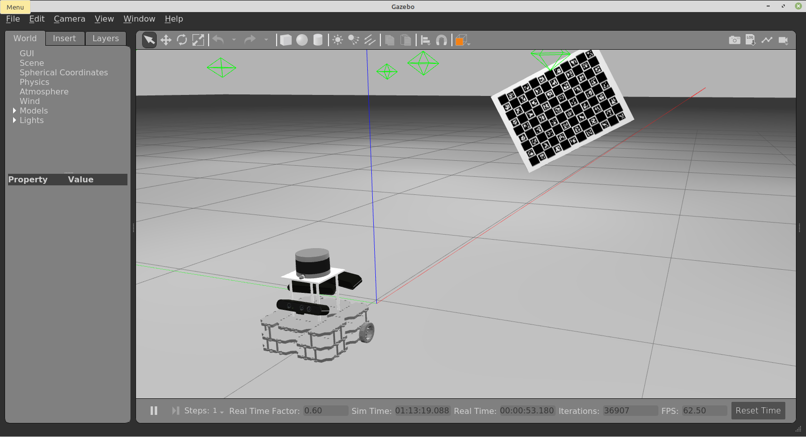

# SIMPLEBot
**S**ensors to **O**dom **F**rame **T**est ro**B**ot (simplebot) is a conceptual robot designed to test advanced calibration methodologies for mobile robotic platforms. In particular, this platform is focused on the calibration of sensors such as rgb cameras or LiDARs w.r.t. the coordination frame of the motion model of the robot. 

We refer to this functional coordinate frame, around which the robot rotates as it moves, as the **odom frame**, since it is used to compute the odometry. Naturally, the odom frame changes position in accordance with the motion model of the robot, e.g. differential drive, ackerman steering etc. 

The system contains the following sensors:
- **3dlidar** - A 3D LiDAR mounted on the robot frame;
- **rgbd_cameras** - Three RGB-D cameras mounted on the robot frame, two facing the front and one facing the back of the robot.




# How to run

First launch the gazebo simulation:

    roslaunch simplebot_gazebo simplebot.launch 

Then you can spawn the simplebot robot:

    roslaunch simplebot_bringup bringup.launch

You can record a bag file using:

    roslaunch simplebot_bringup record.launch


# Installation

##### Add to .bashrc:
```
export ROS_BAGS="/home/<username>/bagfiles"
export ATOM_DATASETS="/home/<username>/datasets"
export GAZEBO_MODEL_PATH="`rospack find simplebot_gazebo`/models:${GAZEBO_MODEL_PATH}"
```
